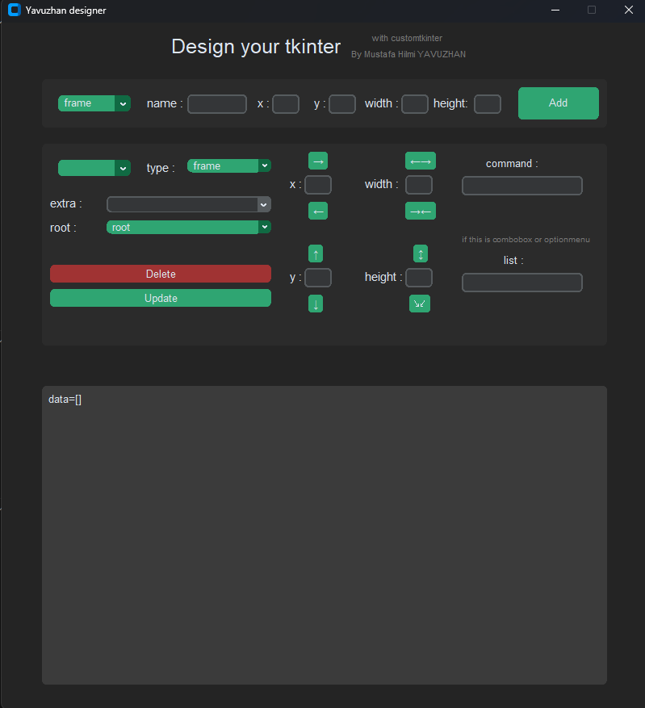

## Project Dependencies

To install the necessary dependency for the project, use the following command:

```bash
pip install customtkinter
```
### Interface Design
Open the designer.py file to design the interface as per your preferences. Paste the created interface into the text-box within the data.txt file and save it.


### designer.py is example for you


### Running the Project
To run the project, simply execute the gui.py file. This will generate a graphical user interface based on the design you created in the previous step.

### Enjoy exploring your project!
